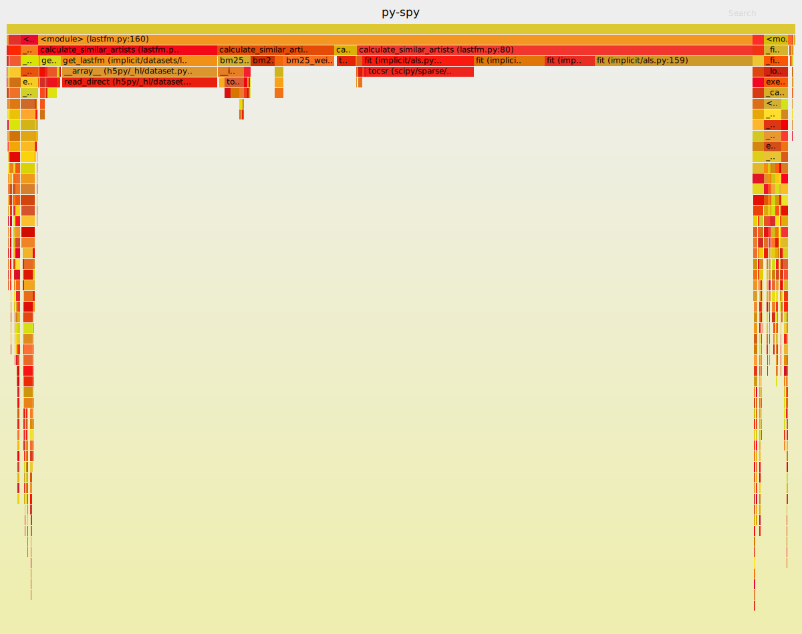
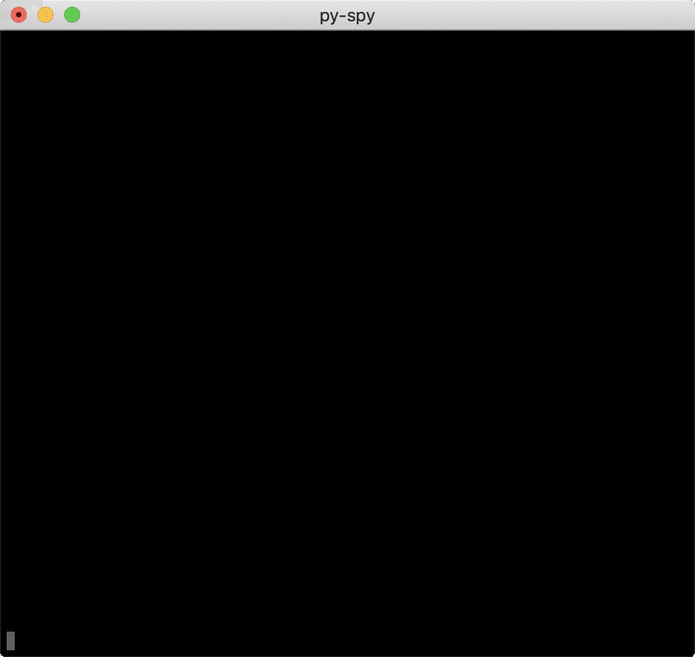
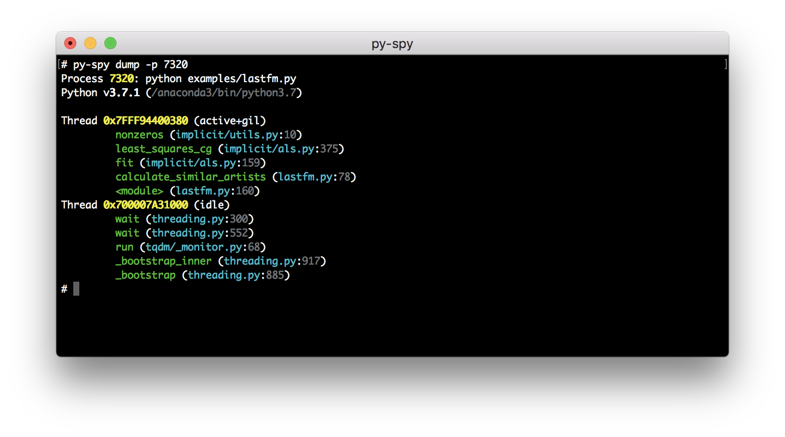

py-spy: Sampling profiler for Python programs
=====
[](https://github.com/benfred/py-spy/actions?query=branch%3Amaster)
[](https://cirrus-ci.com/github/benfred/py-spy)

py-spy is a sampling profiler for Python programs. It lets you visualize what your Python
program is spending time on without restarting the program or modifying the code in any way.
py-spy is extremely low overhead: it is written in Rust for speed and doesn't run
in the same process as the profiled Python program. This means py-spy is safe to use against production Python code.

py-spy works on Linux, OSX, Windows and FreeBSD, and supports profiling all recent versions of the CPython
interpreter (versions 2.3-2.7 and 3.3-3.13).

## Installation

Prebuilt binary wheels can be installed from PyPI with:

```
pip install py-spy
```

You can also download prebuilt binaries from the [GitHub Releases
Page](https://github.com/benfred/py-spy/releases).

If you're a Rust user, py-spy can also be installed with: ```cargo install py-spy```. Note this
builds py-spy from source and requires `libunwind` on Linux and Window, e.g., 
`apt install libunwind-dev`.

On macOS, [py-spy is in Homebrew](https://formulae.brew.sh/formula/py-spy#default) and 
can be installed with ```brew install py-spy```.

On Arch Linux, [py-spy is in AUR](https://aur.archlinux.org/packages/py-spy/) and can be
installed with ```yay -S py-spy```.

On Alpine Linux, [py-spy is in testing repository](https://pkgs.alpinelinux.org/packages?name=py-spy&branch=edge&repo=testing) and
can be installed with ```apk add py-spy --update-cache --repository http://dl-3.alpinelinux.org/alpine/edge/testing/ --allow-untrusted```.

## Usage

py-spy works from the command line and takes either the PID of the program you want to sample from
or the command line of the python program you want to run. py-spy has three subcommands
```record```, ```top``` and ```dump```:

### record

py-spy supports recording profiles to a file using the ```record``` command. For example, you can
generate a [flame graph](http://www.brendangregg.com/flamegraphs.html) of your python process by
going:

``` bash
py-spy record -o profile.svg --pid 12345
# OR
py-spy record -o profile.svg -- python myprogram.py
```

Which will generate an interactive SVG file looking like:



You can change the file format to generate
[speedscope](https://github.com/jlfwong/speedscope) profiles or raw data with the ```--format``` parameter.
See ```py-spy record --help``` for information on other options including changing
the sampling rate, filtering to only include threads that hold the GIL, profiling native C extensions,
showing thread-ids, profiling subprocesses and more.

### top

Top shows a live view of what functions are taking the most time in your python program, similar
to the Unix [top](https://linux.die.net/man/1/top) command. Running py-spy with:

``` bash
py-spy top --pid 12345
# OR
py-spy top -- python myprogram.py
```

will bring up a live updating high level view of your python program:



### dump

py-spy can also display the current call stack for each python thread with the ```dump``` command:

```bash
py-spy dump --pid 12345
```

This will dump out the call stacks for each thread, and some other basic process info to the
console:



This is useful for the case where you just need a single call stack to figure out where your
python program is hung on. This command also has the ability to print out the local variables
associated with each stack frame by setting the ```--locals``` flag.

## Frequently Asked Questions

### Why do we need another Python profiler?

This project aims to let you profile and debug any running Python program, even if the program is
serving production traffic.

While there are many other python profiling projects, almost all of them require modifying
the profiled program in some way. Usually, the profiling code runs inside of the target python process,
which will slow down and change how the program operates. This means it's not generally safe
to use these profilers for debugging issues in production services since they will usually have
a noticeable impact on performance.

### How does py-spy work?

py-spy works by directly reading the memory of the python program using the
[process_vm_readv](http://man7.org/linux/man-pages/man2/process_vm_readv.2.html) system call on Linux,
the [vm_read](https://developer.apple.com/documentation/kernel/1585350-vm_read?language=objc) call on OSX
or the [ReadProcessMemory](https://msdn.microsoft.com/en-us/library/windows/desktop/ms680553(v=vs.85).aspx) call
on Windows.

Figuring out the call stack of the Python program is done by looking at the global PyInterpreterState variable
to get all the Python threads running in the interpreter, and then iterating over each PyFrameObject in each thread
to get the call stack. Since the Python ABI changes between versions, we use rust's [bindgen](https://github.com/rust-lang-nursery/rust-bindgen) to generate different rust structures for each Python interpreter
class we care about and use these generated structs to figure out the memory layout in the Python program.

Getting the memory address of the Python Interpreter can be a little tricky due to [Address Space Layout Randomization](https://en.wikipedia.org/wiki/Address_space_layout_randomization). If the target python interpreter ships
with symbols it is pretty easy to figure out the memory address of the interpreter by dereferencing the
```interp_head```  or ```_PyRuntime``` variables depending on the Python version. However, many Python
versions are shipped with either stripped binaries or shipped without the corresponding PDB symbol files on Windows. In
these cases we scan through the BSS section for addresses that look like they may point to a valid PyInterpreterState
and check if the layout of that address is what we expect.


### Can py-spy profile native extensions?

Yes! py-spy supports profiling native python extensions written in languages like C/C++ or Cython,
on x86_64 Linux and Windows. You can enable this mode by passing ```--native``` on the
command line. For best results, you should compile your Python extension with symbols. Also worth
noting for Cython programs is that py-spy needs the generated C or C++ file in order to return line
numbers of the original .pyx file.  Read the [blog post](https://www.benfrederickson.com/profiling-native-python-extensions-with-py-spy/)
for more information.

### How can I profile subprocesses?

By passing in the ```--subprocesses``` flag to either the record or top view, py-spy will also include
the output from any python process that is a child process of the target program. This is useful
for profiling applications that use multiprocessing or gunicorn worker pools. py-spy will monitor
for new processes being created, and automatically attach to them and include samples from them in
the output. The record view will include the PID and cmdline of each program in the callstack,
with subprocesses appearing as children of their parent processes.

### When do you need to run as sudo?

py-spy works by reading memory from a different python process, and this might not be allowed for security reasons depending on
your OS and system settings. In many cases, running as a root user (with sudo or similar) gets around these security restrictions.
OSX always requires running as root, but on Linux it depends on how you are launching py-spy and the system
security settings.

On Linux the default configuration is to require root permissions when attaching to a process that isn't a child.
For py-spy this means you can profile without root access by getting py-spy to create the process
(```py-spy record  -- python myprogram.py```) but attaching to an existing process by specifying a
PID will usually require root (```sudo py-spy record --pid 123456```).
You can remove this restriction on Linux by setting the [ptrace_scope sysctl variable](https://wiki.ubuntu.com/SecurityTeam/Roadmap/KernelHardening#ptrace_Protection).

### How do you detect if a thread is idle or not?

py-spy attempts to only include stack traces from threads that are actively running code, and exclude threads that
are sleeping or otherwise idle. When possible, py-spy attempts to get this thread activity information
from the OS: by reading in  ```/proc/PID/stat``` on Linux, by using the mach
[thread_basic_info](https://opensource.apple.com/source/xnu/xnu-792/osfmk/mach/thread_info.h.auto.html)
call on OSX, and by looking if the current SysCall is [known to be
idle](https://github.com/benfred/py-spy/blob/8326c6dbc6241d60125dfd4c01b70fed8b8b8138/remoteprocess/src/windows/mod.rs#L212-L229)
on Windows.

There are some limitations with this approach though that may cause idle threads to still be
marked as active. First off, we have to get this thread activity information before pausing the
program, because getting this from a paused program will cause it to always return that this is
idle. This means there is a potential race condition, where we get the thread activity and
then the thread is in a different state when we get the stack trace. Querying the OS for thread
activity also isn't implemented yet for FreeBSD and i686/ARM processors on Linux. On Windows,
calls that are blocked on IO also won't be marked as idle yet, for instance when reading input
from stdin. Finally, on some Linux calls the ptrace attach that we are using may cause idle threads
to wake up momentarily, causing false positives when reading from procfs. For these reasons, 
we also have a heuristic fallback that marks known certain known calls in
python as being idle. 

You can disable this functionality by setting the ```--idle``` flag, which
will include frames that py-spy considers idle.  

### How does GIL detection work?

We get GIL activity by looking at the threadid value pointed to by the ```_PyThreadState_Current``` symbol
for Python 3.6 and earlier and by figuring out the equivalent from the ```_PyRuntime``` struct in
Python 3.7 and later. These symbols might not be included in your python distribution, which will
cause resolving which thread holds on to the GIL to fail. Current GIL usage is also shown in the 
```top``` view as %GIL.

Passing the ```--gil``` flag will only include traces for threads that are holding on to the
[Global Interpreter Lock](https://wiki.python.org/moin/GlobalInterpreterLock). In some cases this
might be a more accurate view of how your python program is spending its time, though you should
be aware that this will miss activity in extensions that release the GIL while still active.

### Why am I having issues profiling /usr/bin/python on OSX?

OSX has a feature called [System Integrity Protection](https://en.wikipedia.org/wiki/System_Integrity_Protection) that prevents even the root user from reading memory from any binary located in /usr/bin. Unfortunately, this includes the python interpreter that ships with OSX.

There are a couple of different ways to deal with this:
 * You can install a different Python distribution. The built-in Python [will be removed](https://developer.apple.com/documentation/macos_release_notes/macos_catalina_10_15_release_notes) in a future OSX, and you probably want to migrate away from Python 2 anyways =).
 * You can use [virtualenv](https://virtualenv.pypa.io/en/stable/) to run the system python in an environment where SIP doesn't apply.
 * You can [disable System Integrity Protection](https://www.macworld.co.uk/how-to/mac/how-turn-off-mac-os-x-system-integrity-protection-rootless-3638975/).

### How do I run py-spy in Docker?

Running py-spy inside of a docker container will also usually bring up a permissions denied error even when running as root.

This error is caused by docker restricting the process_vm_readv system call we are using. This can
be overridden by setting
[```--cap-add SYS_PTRACE```](https://docs.docker.com/engine/security/seccomp/) when starting the docker container.

Alternatively you can edit the docker-compose yaml file

```
your_service:
   cap_add:
     - SYS_PTRACE
```

Note that you'll need to restart the docker container in order for this setting to take effect.

You can also use py-spy from the Host OS to profile a running process running inside the docker
container. 

### How do I run py-spy in Kubernetes?

py-spy needs `SYS_PTRACE` to be able to read process memory. Kubernetes drops that capability by default, resulting in the error
```
Permission Denied: Try running again with elevated permissions by going 'sudo env "PATH=$PATH" !!'
```
The recommended way to deal with this is to edit the spec and add that capability. For a deployment, this is done by adding this to `Deployment.spec.template.spec.containers`
```
securityContext:
  capabilities:
    add:
    - SYS_PTRACE
```
More details on this here: https://kubernetes.io/docs/tasks/configure-pod-container/security-context/#set-capabilities-for-a-container
Note that this will remove the existing pods and create those again.

### How do I install py-spy on Alpine Linux?

Alpine python opts out of the `manylinux` wheels: [pypa/pip#3969 (comment)](https://github.com/pypa/pip/issues/3969#issuecomment-247381915).
You can override this behaviour to use pip to install py-spy on Alpine by going:

    echo 'manylinux1_compatible = True' > /usr/local/lib/python3.7/site-packages/_manylinux.py

Alternatively you can download a musl binary from the [GitHub releases page](https://github.com/benfred/py-spy/releases).

### How can I avoid pausing the Python program?

By setting the ```--nonblocking``` option, py-spy won't pause the target python you are profiling from. While
the performance impact of sampling from a process with py-spy is usually extremely low, setting this option
will totally avoid interrupting your running python program.

With this option set, py-spy will instead read the interpreter state from the python process as it is running.
Since the calls we use to read memory from are not atomic, and we have to issue multiple calls to get a stack trace this
means that occasionally we get errors when sampling. This can show up as an increased error rate when sampling, or as
partial stack frames being included in the output.

### Does py-spy support 32-bit Windows? Integrate with PyPy? Work with USC2 versions of Python2?

Not yet =).

If there are features you'd like to see in py-spy either thumb up the [appropriate
issue](https://github.com/benfred/py-spy/issues?q=is%3Aissue+is%3Aopen+sort%3Areactions-%2B1-desc) or create a new one that describes what functionality is missing.

### How to force colored output when piping to a pager?

py-spy follows the [CLICOLOR](https://bixense.com/clicolors/) specification, thus setting `CLICOLOR_FORCE=1` in your environment will have py-spy print colored output even when piped to a pager.

## Credits

py-spy is heavily inspired by [Julia Evans](https://github.com/jvns/) excellent work on [rbspy](http://github.com/rbspy/rbspy).
In particular, the code to generate flamegraph and speedscope files is taken directly from rbspy, and this project uses the
[read-process-memory](https://github.com/luser/read-process-memory) and [proc-maps](https://github.com/benfred/proc-maps) crates that were spun off from rbspy.

## License

py-spy is released under the MIT License, see the [LICENSE](https://github.com/benfred/py-spy/blob/master/LICENSE) file for the full text.
