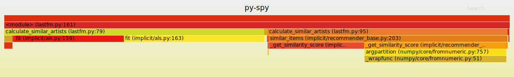

py-spy: A sampling profiler for Python programs.
=====
[](https://travis-ci.org/benfred/py-spy)
[](https://ci.appveyor.com/project/benfred/py-spy)

py-spy is a sampling profiler for Python programs. It lets you visualize what your Python
program is spending time on without restarting the program or modifying the code in any way.
py-spy is extremely low overhead: it is written in Rust for speed and doesn't run
in the same process as the profiled Python program. This means py-spy is safe to use against production Python code.

py-spy works on Linux, OSX, Windows and FreeBSD, and supports profiling all recent versions of the CPython
interpreter (versions 2.3-2.7 and 3.3-3.7).

## Installation

Prebuilt binary wheels can be installed from PyPI with:

```
pip install py-spy
```

If you're a Rust user, py-spy can also be installed with:

```
cargo install py-spy
```

On Arch Linux, [py-spy is in AUR](https://aur.archlinux.org/packages/py-spy/) and can be
installed by using your favorite AUR helper, for example:

```
yay -S py-spy
```

## Usage

py-spy works from the command line and takes either the PID of the program you want to sample from or the command line of the python program you want to run:

``` bash
py-spy --pid 12345
# OR
py-spy -- python myprogram.py
```

The default visualization is a [top-like](https://linux.die.net/man/1/top) live view of your python program:


There is also support for generating [flame graphs](http://www.brendangregg.com/flamegraphs.html) from the running process:

``` bash
py-spy --flame profile.svg --pid 12345
# OR
py-spy --flame profile.svg -- python myprogram.py
```

Which will generate a SVG file looking like:



It also possible to dump out the current call stack for each thread by passing ```--dump``` to the command line.

## Frequently Asked Questions

### Why do we need another Python profiler?

This project aims to let you profile and debug any running Python program, even if the program is
serving production traffic.

While there are many other python profiling projects, almost all of them require modifying
the profiled program in some way. Usually, the profiling code runs inside of the target python process,
which will slow down and change how the program operates. This means it's not generally safe
to use these profilers for debugging issues in production services since they will usually have
a noticeable impact on performance. The only other Python profiler
that runs totally in a separate process is [pyflame](https://github.com/uber/pyflame), which profiles
 remote python processes by using the ptrace system call. While pyflame is a great project,
 it doesn't support Python 3.7 yet and doesn't work on OSX, Windows or FreeBSD.

### How does py-spy work?

py-spy works by directly reading the memory of the python program using the
[process_vm_readv](http://man7.org/linux/man-pages/man2/process_vm_readv.2.html) system call on Linux,
the [vm_read](https://developer.apple.com/documentation/kernel/1585350-vm_read?language=objc) call on OSX
or the [ReadProcessMemory](https://msdn.microsoft.com/en-us/library/windows/desktop/ms680553(v=vs.85).aspx) call
on Windows.

Figuring out the call stack of the Python program is done by looking at the global PyInterpreterState variable
 to get all the Python threads running in the interpreter, and then iterating over each PyFrameObject in each thread
 to get the call stack. Since the Python ABI changes between versions, we use rust's [bindgen](https://github.com/rust-lang-nursery/rust-bindgen) to generate different rust structures for each Python interpreter
 class we care about and use these generated structs to figure out the memory layout in the Python program.

Getting the memory address of the Python Interpreter can be a little tricky due to [Address Space Layout Randomization](https://en.wikipedia.org/wiki/Address_space_layout_randomization). If the target python interpreter ships
with symbols it is pretty easy to figure out the memory address of the interpreter by dereferencing the
```interp_head```  or ```_PyRuntime``` variables depending on the Python version. However, many Python
versions are shipped with either stripped binaries or shipped without the corresponding PDB symbol files on Windows. In
these cases we scan through the BSS section for addresses that look like they may point to a valid PyInterpreterState
and check if the layout of that address is what we expect.


### Can py-spy profile native extensions?

Since we're getting the call stacks of the python program by looking at the
[PyInterpreterState](https://docs.python.org/3/c-api/init.html#c.PyInterpreterState) we don't yet
get information about non-python threads and can't profile native extensions like those written in languages
like Cython or C++. Native code will instead show up as spending time in the line of Python that calls the native function,
rather than as its own entry in the current stable release.

However, there is a pre-release at ```pip install py-spy==0.2.0.dev3``` that will let you profile
native C/C++ or Cython extensions on 64-bit Linux and Windows machines. Any feedback on this feature is appreciated,
and you can follow progress or leave comments [on this issue](https://github.com/benfred/py-spy/issues/2).

### When do you need to run as sudo?

py-spy works by reading memory from a different python process, and this might not be allowed for security reasons depending on
your OS and system settings. In many cases, running as a root user (with sudo or similar) gets around these security restrictions.
OSX always requires running as root, but on Linux it depends on how you are launching py-spy and the system
security settings.

On Linux the default configuration is to require root permissions when attaching to a process that isn't a child.
For py-spy this means you can profile without root access by getting py-spy to create the process (```py-spy -- python myprogram.py```) but attaching to an existing process by specifying a PID will usually require root (```sudo py-spy --pid 123456```).
You can remove this restriction on linux by setting the [ptrace_scope sysctl variable](https://wiki.ubuntu.com/SecurityTeam/Roadmap/KernelHardening#ptrace_Protection).

### Why am I having issues profiling /usr/bin/python on OSX?

OSX has a feature called [System Integrity Protection](https://en.wikipedia.org/wiki/System_Integrity_Protection) that prevents even the root user from reading memory from any binary located in /usr/bin. Unfortunately, this includes the python interpreter that ships with OSX.

There are a couple of different ways to deal with this:
 * You can install a different Python distribution (you probably want to migrate away from python2 anyways =)
 * You can use [virtualenv](https://virtualenv.pypa.io/en/stable/) to run the system python in an environment where SIP doesn't apply.
 * You can [disable System Integrity Protection](https://www.macworld.co.uk/how-to/mac/how-turn-off-mac-os-x-system-integrity-protection-rootless-3638975/).

### How do I run py-spy in Docker?

Running py-spy inside of a docker container will also usually bring up a permissions denied error even when running as root.

This error is caused by docker restricting the process_vm_readv system call we are using. This can
be overridden by setting
[```--cap-add SYS_PTRACE```](https://docs.docker.com/engine/security/seccomp/) when starting the docker container.

Alternatively you can edit the docker-compose yaml file

```
your_service:
   cap_add:
     - SYS_PTRACE
```

Note that you'll need to restart the docker container in order for this setting to take effect.

### How do I run py-spy in Kubernetes?

py-spy needs `SYS_PTRACE` to be able to read process memory. Kubernetes drops that capability by default, resulting in the error
```
Permission Denied: Try running again with elevated permissions by going 'sudo env "PATH=$PATH" !!'
```
The recommended way to deal with this is to edit the spec and add that capability. For a deployment, this is done by adding this to `Deployment.spec.template.spec.containers`
```
securityContext:
  capabilities:
    add:
    - SYS_PTRACE
```
More details on this here: https://kubernetes.io/docs/tasks/configure-pod-container/security-context/#set-capabilities-for-a-container
Note that this will remove the existing pods and create those again.

### How do I install py-spy on Alpine Linux?

Alpine python opts out of the `manylinux` wheels: [pypa/pip#3969 (comment)](https://github.com/pypa/pip/issues/3969#issuecomment-247381915).
You can override this behaviour to use pip to install py-spy on Alpine by going:

    echo 'manylinux1_compatible = True' > /usr/local/lib/python3.7/site-packages/_manylinux.py


### How can you avoid pausing the Python program?

By setting the ```--nonblocking``` option, py-spy won't pause the target python you are profiling from. While
the performance impact of sampling from a process with py-spy is usually extremely low, setting this option
will totally avoid interrupting your running python program.

With this option set, py-spy will instead read the interpreter state from the python process as it is running.
Since the calls we use to read memory from are not atomic, and we have to issue multiple calls to get a stack trace this
means that occasionally we get errors when sampling. This can show up as an increased error rate when sampling, or as
partial stack frames being included in the output.

### How are you distributing Rust executable binaries over PyPI?

Ok, so no-one has ever actually asked me this - but I wanted to share since it's a pretty terrible hack
that might be useful to other people.

I really wanted to distribute this package over PyPI, since installing with pip will make this much easier
for most Python programmers to get installed on their system. Unfortunately, [installing executables as python
scripts isn't something that setuptools supports](https://github.com/pypa/setuptools/issues/210).

To get around this I'm using setuptools_rust package to build the py-spy
binary, and then overriding the [distutils install command](https://github.com/benfred/py-spy/blob/master/setup.py#L20)
to copy the built binary into the python scripts folder. By doing this with prebuilt wheels for supported
platforms means that we can install py-spy with pip, and not require a Rust compiler on the machine that
this is being installed onto.

### Does py-spy support 32-bit Windows? Integrate with PyPy? Work with USC2 versions of Python2?

Not yet =).

## Credits

py-spy is heavily inspired by [Julia Evans](https://github.com/jvns/) excellent work on [rbspy](http://github.com/rbspy/rbspy).
In particular, the code to generate the flamegraphs is taken directly from rbspy, and this project uses the
[read-process-memory](https://github.com/luser/read-process-memory) and [proc-maps](https://github.com/benfred/proc-maps) crates that were spun off from rbspy.

## License

py-spy is released under the GNU General Public License v3.0, see the [LICENSE](https://github.com/benfred/py-spy/blob/master/LICENSE) file for the full text.
